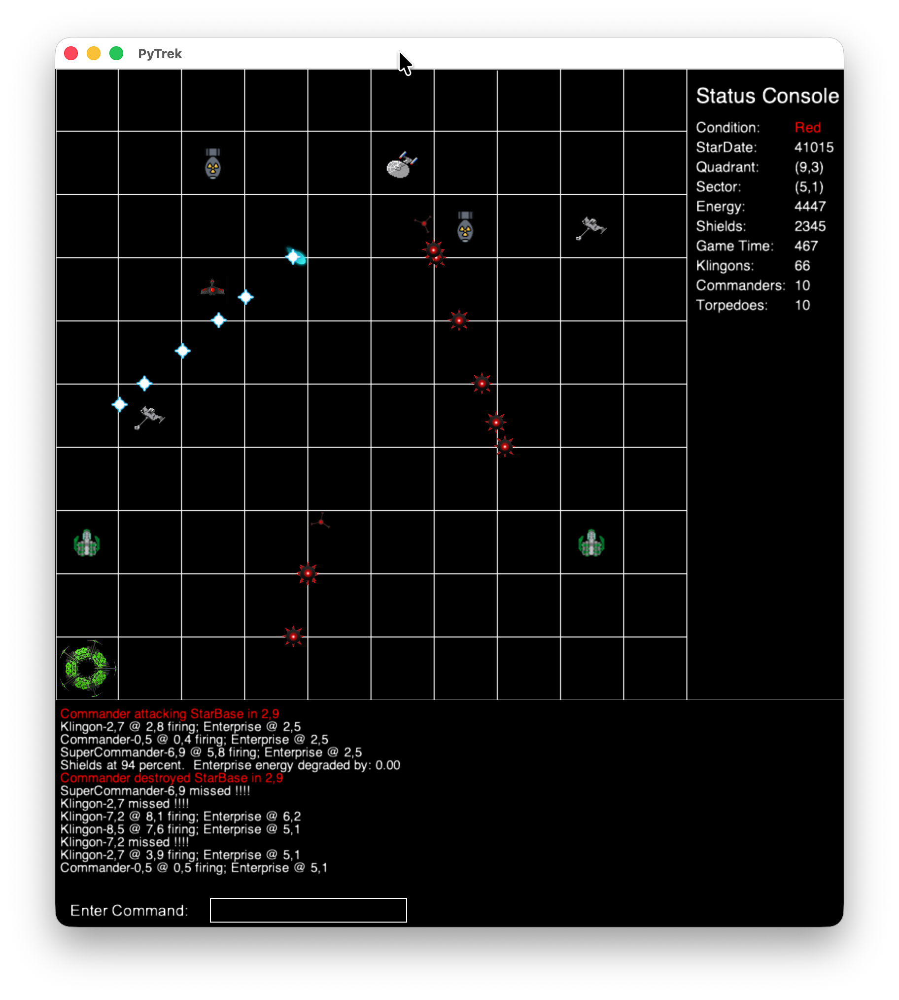
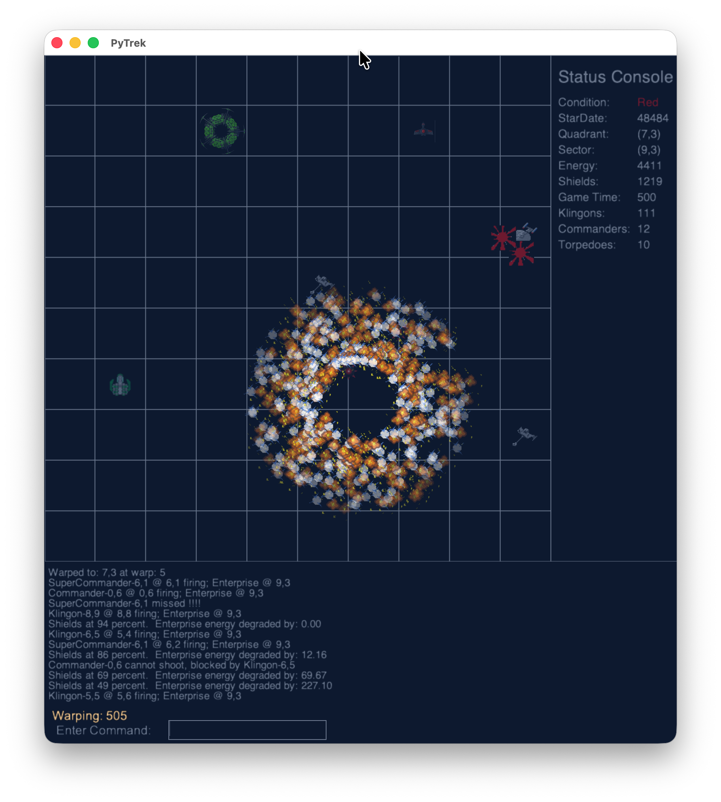
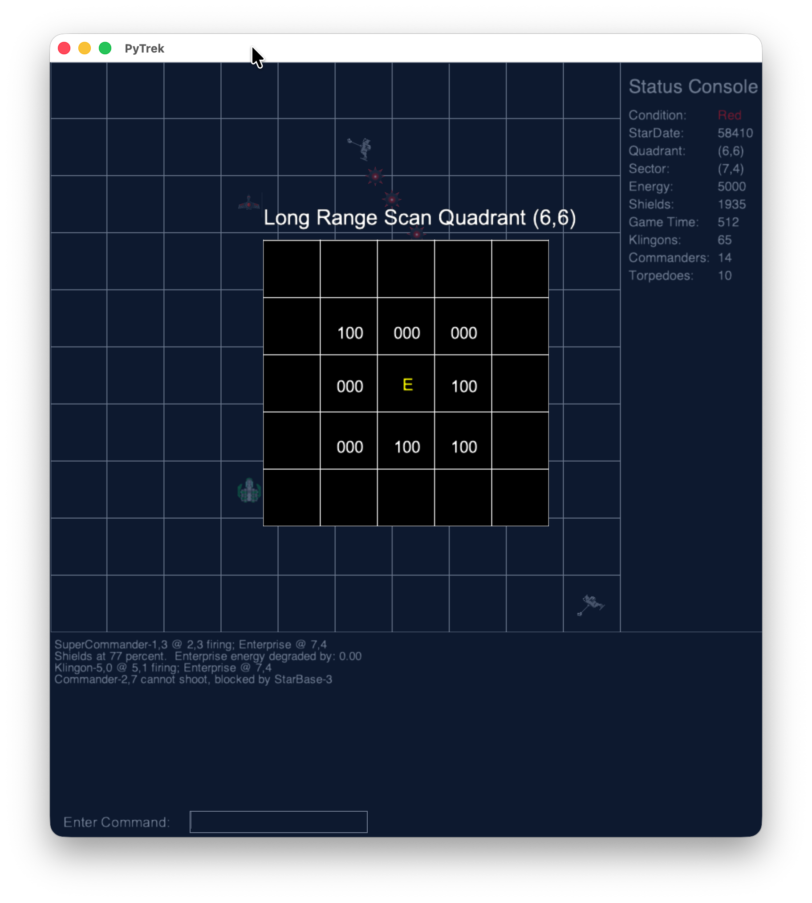
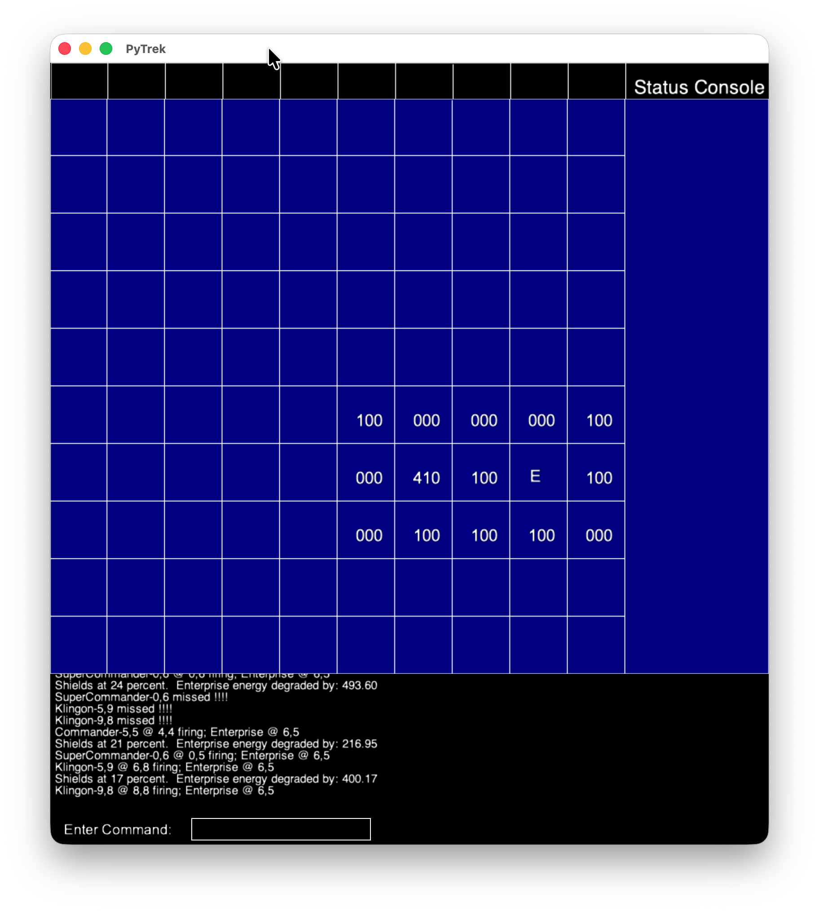
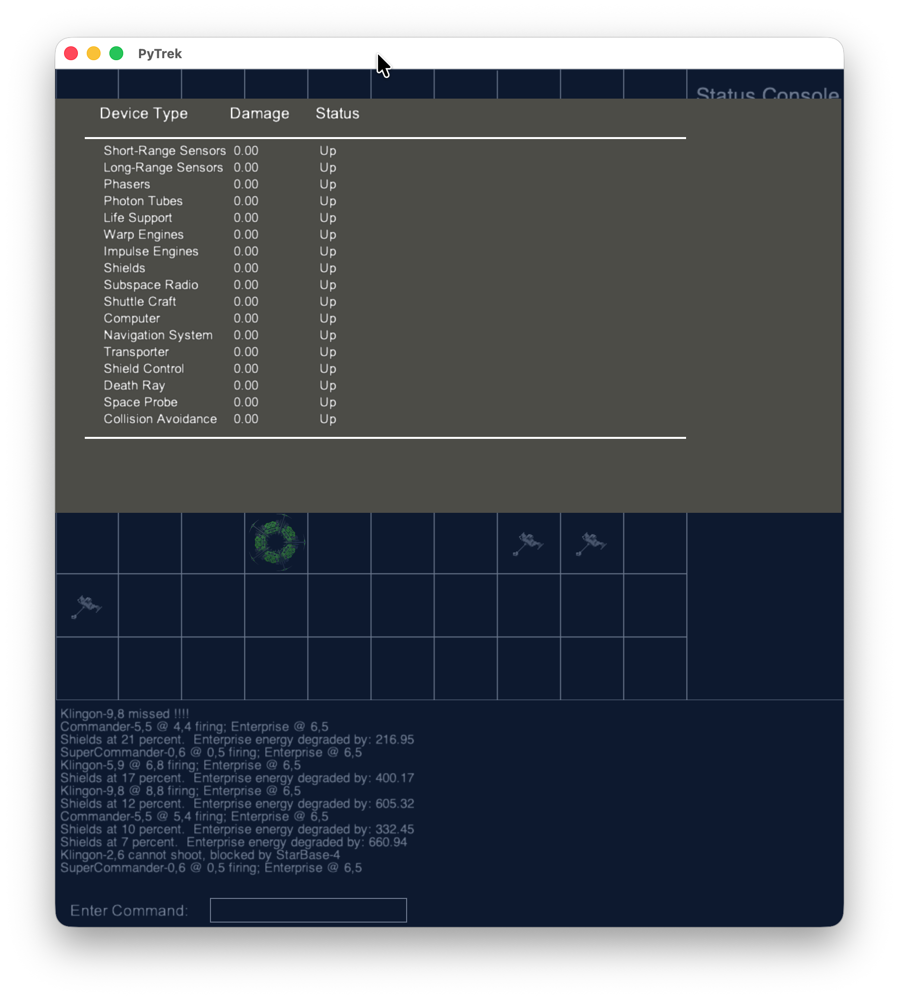

# PyTrek Gameplay Description

PyTrek is a modern, graphical Python reimplementation of the classic **Super Star Trek** game. Developed using the Arcade library, it brings the tactical space combat and galactic navigation of the 1970s mainframe classic into a rich, visual 2D interface.

---

## 1. Premise & Objective

The [Organian Peace Treaty](https://www.st-minutiae.com/articles/treaties/organian.html) has collapsed, and the United Federation of Planets is at war with the Klingon Empire. As commander of the Starship **U.S.S. Enterprise**, your primary objective is to seek out and destroy the Klingon invasion fleet before the time limit expires and the Federation collapses. 

Your battleground is the entire galaxy, structured as a **10x10 grid of quadrants**. Each quadrant is further subdivided into a **10x10 grid of sectors**. 

---

## 2. Sector Navigation & Combat (The Quadrant View)

When you enter a quadrant, you are presented with the **Quadrant View**, displaying local space in a 10x10 tactical grid. This screen shows the Enterprise, active enemy vessels, stars, planets, and Federation Starbases.

### Key Features of the Quadrant View:

* **The USS Enterprise:** Your ship is:
    * situated on the grid
    * capable of maneuvering and firing weapons.

* **Enemies:** You will face ordinary
    * Klingons
    * Klingon Commanders (stronger and capable of moving and using tractor beams)
    * The dreaded Super-commander (which hunts Starbases and moves between quadrants).

* **Starbases:** Safe havens represented by green circular icons. Docking adjacent to a Starbase replenishes your energy, phton torpedoes, and repairs damaged systems.
* **Tactical Display & Sound:** Real-time visual feedback is shown for phaser fire (blue directional bolts), photon torpedoes (gray torpedo sprites with radiation symbols), and explosions/damage.
* **Status Console:** Located on the right, it monitors:
    * Your current Condition (Green, Yellow, Red, or Docked), StarDate
    * the current coordinates
    * energy reserves
    * shields
    * remaining game time
    * enemy counts.

* **Message Log:** Displays real-time tactical outputs at the bottom of the screen, tracking hits, shield status, and incoming enemy fire.

---

## 3. Galactic Travel & The Warp Effect

To travel between the 64 quadrants of the galaxy, the Enterprise uses its Warp Drive. Movement is governed by your current **Warp Factor**, which determines the speed, time elapsed, and energy consumed.

### Warp Movement Mechanics:
* **Energy & Time:** Warp travel consumes energy and takes game time proportional to the distance traveled and the warp factor. Having shields active doubles warp energy consumption.
* **Engine Hazards:** Traveling at high warp factors increases the risk of damaging your Warp Engines. If damaged, the chief engineer warns you and your speed is restricted to a maximum safe warp factor (typically Warp 3.0) until repaired.
* **Warp Animation:** Transitioning between quadrants plays a striking, animated stellar warp effect overlay in the center of the quadrant view.
* **Impulse Engines:** If your warp engines are completely offline or if you are moving sector-to-sector within a quadrant, you must use Impulse Engines, which consume a flat rate of energy and travel much more slowly.

---

## 4. Scans & The Galaxy Chart

Information is your greatest asset in PyTrek. You have multiple ways to map the galaxy and track enemy positions.

### Long-Range Scan (LRSCAN)
A Long-Range Scan reveals the contents of the 8 quadrants immediately surrounding the Enterprise in a 3x3 grid window overlay. 

Each adjacent quadrant is represented by a three-digit status code:
* **Hundreds Digit:** The number of Klingons in that quadrant.
* **Tens Digit:** The number of Federation Starbases.
* **Ones Digit:** The number of Stars.
* *Example:* **`410`** indicates 4 Klingons, 1 Starbase, and 0 Stars.
* **`E`** represents the Enterprise's current location.
* **`***`** indicates a Supernova has rendered the quadrant uninhabitable.

### Galaxy Chart (Star Chart)
The Galaxy Chart is a persistent 10x10 map of the entire galaxy. Visited or long-range scanned quadrants display their three-digit status codes, while unexplored sectors remain shrouded.

---

## 5. Device Status & Repairs

The Enterprise is a complex vessel composed of many subsystems. Enemy attacks can damage these devices, rendering them useless or severely degraded. 

Critical systems monitored include:
* **Sensors (Short & Long Range):** Damaged sensors prevent scanning or restrict your view to immediately adjacent sectors.
* **Weapons (Phasers & Torpedoes):** Damage limits weapon accuracy or makes firing systems entirely non-operational.
* **Shields & Shield Control:** Prevents raising shields or adjusting shield power.
* **Warp/Impulse Engines:** Limits navigation or forces sub-warp speeds.
* **Subspace Radio:** Prevents receiving alerts from Starfleet (such as spontaneous supernova warnings).

Damage values are tracked dynamically. You can repair systems by resting (using the `REST` command) or by docking at a Starbase.

---

## 6. Stellar Phenomena & Planetary Exploration

Space is filled with dynamic hazards and resources:
* **Stars & Novas:** Stars can block torpedoes or movements. Shooting a star with a photon torpedo triggers a Nova, which damages adjacent ships or chain-reacts with neighboring stars.
* **Supernovas:** Spontaneous or triggered supernovas completely destroy everything in a quadrant, rendering it permanently uninhabitable.
* **Black Holes:** Black holes swallow torpedoes and enemy ships. Entering a black hole has unpredictable and highly dangerous consequences.
* **Planets & Dilithium Mining:** Uninhabited planets can be scanned for Dilithium Crystals. You can beam down to the surface via Transporter or take the shuttle craft *Galileo* to mine crystals and replenish the Enterprise's energy reserves.
